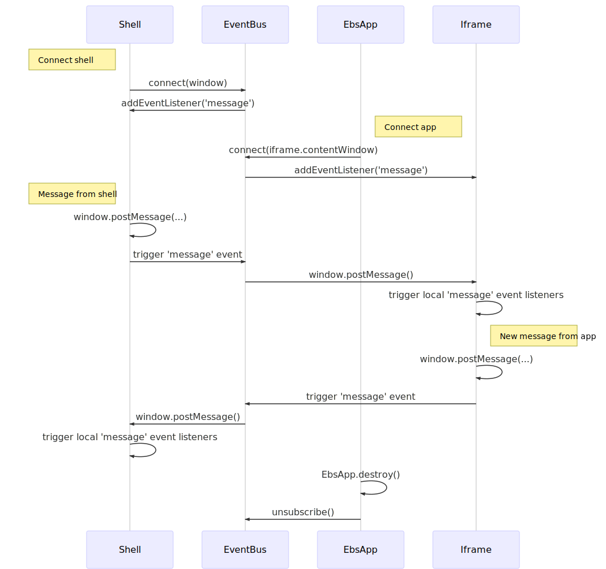

# micro-frontend concept

A PoC implementation of the micro-frontend pattern. The main goals of the concept are:
- Ease of maintenance;
- Stability;
- Freedom to choose different tech stacks.

## Concept

- The main part of each screen is separated in its own micro-frontend
- Micro-frontends are renders inside a "shell" application.
- Each micro-frontend is hosted as a separate application to allow for an independent life cycle.


## Components

- The "shell" application is implemented using Vue.js CLI
- Two micro-frontends: contacts and contracts (TODO) are implemented using Nuxt.js and server-side rendering.

# Embedding micro-frontends

TODO

# Communication

The micro-frontends need to be able to communicate with other micro-frontends and the shell itself. To enable easier
integration of new micro-frontends, the communication is done using an event-based API.

There is a native [window.postMessage()](https://developer.mozilla.org/en-US/docs/Web/API/Window/postMessage) that allows to 
communicate between different `window` objects. Consumers can subscribe to messages by listening to the `message` event. 

Messaging between different `window` objects is seamlessly integrated
together using a simple [event bus](ebs-shell/src/micro-frontends/EventBus.js) that listens to messages on each of the windows
and broadcasts them to others. This way the applications won't even know that they are talking to a different application.

#### Message envelope

Messages are represented using objects with a `type` property and any other payload.

```js
{
    type: 'app.my-message',
    customProperty: 'some-value'
}
```

The `type` property needs to start with `app.` to distinguish application messages from the rest.

#### Messaging sequence diagram



# Deployment view

TODO

# Development

## Development mode

1. Run the contact app:

```bash
cd ebs-contacts
yarn
yarn dev
```

1. Run the shell app:

```bash
cd ebs-shell
yarn
yarn serve
```

## Running in Docker 

TODO

# Notes

## Web Components

Using web components to embed server-side rendered applications has a number of issues:
- JS contained in the embedded app needs to be executed manually. When loading the app using ajax and including it
in the shell, the browser does not evaluate the included `script` tags. They need to be evaluated manually. While this is 
doable for synchronous scripts, it can be tricky to get the execution order correctly when the app uses `async` and `defer`
for loading scripts.
- JS will be executed in the global context. Web components do not provide any mechanism for sandboxing the JS code of the 
embedded app. Since the rest of the HTML code is encapsulated in a shadow root, the globally evaluated scripts will fail to 
access some of the DOM elements. For example, nuxt.js crashes with an error when trying to locate the `#__nuxt` element. 
- Since JS is executed in the global scope, running multiple applications will cause them to interfere with each other. For example, 
nuxt.js relies on the `window.__NUXT__` variable to propagate data from the server-side to the client. Loading libraries of 
different versions for different apps is also likely to cause problems.

Considering these factors, web components don't seem like a proper way to embed server-side rendered applications.

References on using web components:
- https://developer.mozilla.org/en-US/docs/Web/Web_Components
- https://www.sitepen.com/blog/2018/07/06/web-components-in-2018/
- https://custom-elements-everywhere.com/

# References

Useful articles on the micro-frontend pattern:
- https://medium.embengineering.com/micro-front-ends-whats-the-best-solution-3bc31218eae4
- https://medium.com/@_rchaves_/building-microfrontends-part-i-creating-small-apps-710d709b48b7